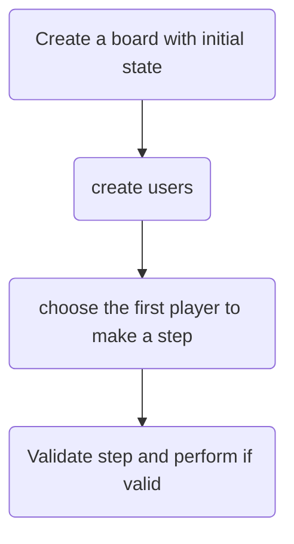

# board-game

## TODO
1. ~~abstraction for boards~~
1. ~~display boards to console~~
1. rules engine
1. step verifier
1. users support
1. model of a board/game to serialize (json?)

## UML

```mermaid
graph TD
A(Create a board with initial state) --> B(create users)
B --> C(choose the first player to make a step)
C --> D(Validate step and perform if valid)
```